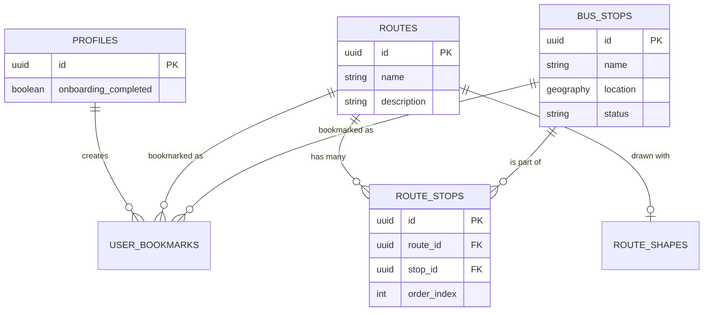

# Komiota Relational Model

This document outlines the core domain model and database schema for the Komiota application. It describes how relationships are structured in our remote database (Supabase PostgreSQL) and how they map to our local-first mobile database (WatermelonDB SQLite).

## Core Entities

### 1. `routes`
Represents a specific transit route or pathway (e.g., "City Bus Line A", "Northbound Jeepney").
- **Attributes:** `id`, `name`, `description`, `created_at`, `updated_at`.
- **WatermelonDB:** Standard Model with `@text` fields.
- **Supabase:** Standard Postgres table.

### 2. `bus_stops`
Represents physical locations where a transit vehicle stops.
- **Attributes:** `id`, `name`, `location` (Spatial), `status` (pending/verified), `image_url`.
- **Supabase (Remote):** Uses PostGIS `GEOGRAPHY(Point, 4326)` for the `location` field to enable fast radius and bounding box queries (e.g., "Find stops near me").
- **WatermelonDB (Local):** SQLite does not natively support PostGIS. In the local schema, the spatial point is split into two numeric columns: `latitude` and `longitude`. The Sync Manager will translate these back into a PostGIS Point when pushing to Supabase.

### 3. `route_stops` (Junction Table)
A many-to-many relationship mapping which stops belong to which routes, and in what order.
- **Attributes:** `id`, `route_id` (FK), `stop_id` (FK), `order_index` (Integer).
- **Explanation:** Essential for determining the sequence of stops for a specific route. `order_index` ensures stops are displayed in the correct geographical or chronological order.

### 4. `route_shapes` (Optional / Future)
If we need to draw precise, predefined lines (polylines) on the map rather than relying on point-to-point routing APIs.
- **Attributes:** `id`, `route_id` (FK), `path_data` (LineString or JSON array of coordinates).
- **Supabase:** Could use PostGIS `GEOMETRY(LineString)`.
- **WatermelonDB:** Stored as a serialized JSON string.

### 5. `profiles`
User profiles linked to Supabase Auth (`auth.users`).
- **Attributes:** `id` (FK to auth.users), `username`, `avatar_url`, `onboarding_completed` (Boolean).
- **Explanation:** Tracks app-specific user data. `onboarding_completed` is critical for ensuring the onboarding UI only shows once per user.

### 6. `user_bookmarks`
Allows users to save their frequently used routes or stops.
- **Attributes:** `id`, `profile_id` (FK), `target_type` (Enum: 'route' or 'stop'), `target_id` (UUID).

## Data Synchronization Strategy
Because Komiota is an offline-first map app, handling geospatial data requires a specific sync strategy:

1. **Pulling Data:** When pulling `bus_stops` from Supabase, the Supabase query/RPC must convert the PostGIS `location` point into separate `lat` and `lng` floats. WatermelonDB inserts these as standard numeric fields.
2. **Pushing Data:** When a user creates a pending `bus_stop` offline, it's saved in WatermelonDB with `lat`/`lng`. During push, the sync function converts these two floats into a PostGIS Point: `ST_SetSRID(ST_MakePoint(lng, lat), 4326)`.

## Diagram Summary

