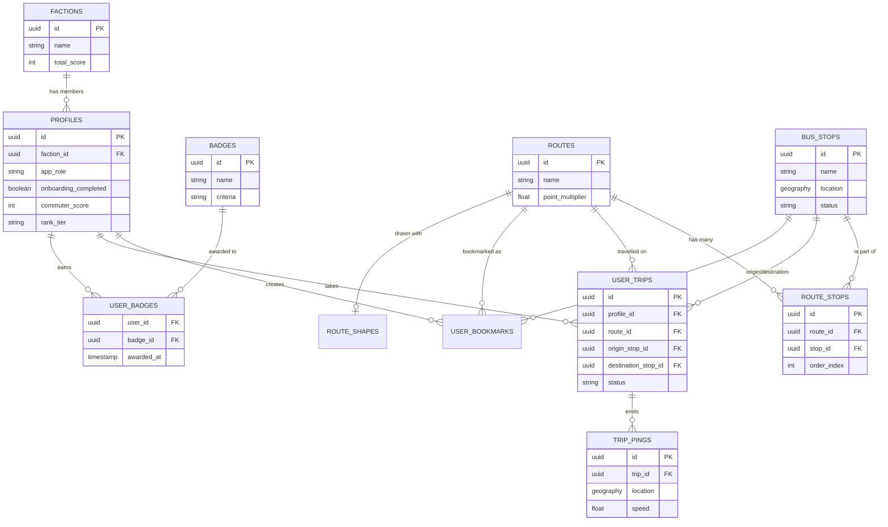

# Komiota Relational Model

This document outlines the core domain model and database schema for the Komiota application. It describes how relationships are structured in our remote database (Supabase PostgreSQL) and how they map to our local-first mobile database (WatermelonDB SQLite).

## Core Entities

### 1. `routes`
Represents a specific transit route or pathway (e.g., "City Bus Line A", "Northbound Jeepney").
- **Attributes:** `id`, `name`, `description`, `point_multiplier` (Numeric/Float, default: 1.0), `created_at`, `updated_at`.
- **WatermelonDB:** Standard Model with `@text` fields and `@field` for the multiplier.
- **Supabase:** Standard Postgres table. `point_multiplier` is used to organically incentivize users to track under-mapped or lower-density routes.

### 2. `bus_stops`
Represents physical locations where a transit vehicle stops.
- **Attributes:** `id`, `name`, `location` (Spatial), `status` (pending/verified), `image_url`.
- **Supabase (Remote):** Uses PostGIS `GEOGRAPHY(Point, 4326)` for the `location` field to enable fast radius and bounding box queries (e.g., "Find stops near me").
- **WatermelonDB (Local):** SQLite does not natively support PostGIS. In the local schema, the spatial point is split into two numeric columns: `latitude` and `longitude`. The Sync Manager will translate these back into a PostGIS Point when pushing to Supabase.

### 3. `route_stops` (Junction Table)
A many-to-many relationship mapping which stops belong to which routes, and in what order.
- **Attributes:** `id`, `route_id` (FK), `stop_id` (FK), `order_index` (Integer).
- **Explanation:** Essential for determining the sequence of stops for a specific route. `order_index` ensures stops are displayed in the correct geographical or chronological order.

### 4. `route_shapes` (Optional / Future)
If we need to draw precise, predefined lines (polylines) on the map rather than relying on point-to-point routing APIs.
- **Attributes:** `id`, `route_id` (FK), `path_data` (LineString or JSON array of coordinates).
- **Supabase:** Could use PostGIS `GEOMETRY(LineString)`.
- **WatermelonDB:** Stored as a serialized JSON string.

### 5. `profiles`
User profiles linked to Supabase Auth (`auth.users`).
- **Attributes:** `id` (FK to auth.users), `username`, `avatar_url`, `onboarding_completed` (Boolean), `app_role` (Enum: 'user', 'admin'), `commuter_score` (Integer), `total_trips` (Integer), `total_distance_km` (Float), `rank_tier` (String), `commuters_helped` (Integer), `current_streak` (Integer), `longest_streak` (Integer), `faction_id` (FK to `factions`).
- **Explanation:** Tracks app-specific user data. `app_role` defines administrative privileges. Includes gamification stats to incentivize tracking. `onboarding_completed` ensures the onboarding UI only shows once per user.

### 6. `user_bookmarks`
Allows users to save their frequently used routes or stops.
- **Attributes:** `id`, `profile_id` (FK), `target_type` (Enum: 'route' or 'stop'), `target_id` (UUID).

### 7. `user_trips` (Live Tracking Session)
Tracks a user's current live transit session from boarding to arriving.
- **Attributes:** `id`, `profile_id` (FK), `route_id` (FK), `origin_stop_id` (FK), `destination_stop_id` (FK), `status` (Enum: 'waiting', 'in_transit', 'completed', 'cancelled'), `started_at`, `ended_at`.
- **Explanation:** Represents an active commute. Used to aggregate live data and calculate rewards for the user's gamified `commuter_score`.

### 8. `trip_pings` (High-Frequency Live Data)
Ephemeral, high-frequency GPS snapshots broadcasted by users currently "in transit".
- **Attributes:** `id`, `trip_id` (FK to `user_trips`), `location` (PostGIS `GEOGRAPHY(Point, 4326)`), `speed` (Float), `heading` (Float), `created_at`.
- **Explanation:** Stores the actual live location data. Uses PostGIS for fast geospatial queries. This table should likely have aggressive retention policies (e.g., partitioned and dropping older pings) as it only serves real-time live ETA features.

### 9. `factions` (Teams for Leaderboards)
Allows users to join community teams (e.g., "Team North", "Team South") to compete in geographic or community leaderboards.
- **Attributes:** `id`, `name`, `description`, `total_score` (Integer).

### 10. `badges`
Definitions for gamification achievements.
- **Attributes:** `id`, `name`, `description`, `icon_url`, `criteria`.

### 11. `user_badges` (Junction Table)
Maps the achievements a user has unlocked.
- **Attributes:** `user_id` (FK to `profiles`), `badge_id` (FK to `badges`), `awarded_at`.

## Security & Roles (Critical)

### User Roles & Metadata Constraint
The `profiles` table includes an `app_role` column (Enum: 'user', 'admin') to dictate privileges. 
- **CRITICAL SECURITY CONSTRAINT:** The user role **MUST NOT** be stored inside Supabase's `auth.users` `user_metadata` field. The `user_metadata` field can be freely updated by the client via the `supabase.auth.updateUser()` API, making it extremely vulnerable to spoofing (e.g., a user granting themselves admin rights). Always store roles securely in the public `profiles` table.

### Row Level Security (RLS) Strategy
- **Protected Mutations:** RLS policies must be configured so that users can update their own standard profile details, but the `app_role` column is strictly protected from any client-side `UPDATE` mutations to prevent privilege escalation.
- **Admin Function:** A secure Postgres function `is_admin()` should be created to check the executing user's role. This function will be used inside RLS policies for administrative endpoints, such as approving crowdsourced `bus_stops` or moderating gamification content.

## Data Synchronization Strategy
Because Komiota is an offline-first map app with a hybrid online live-tracking architecture, the data strategy is split into two distinct parts:

### 1. Static/Offline Data (WatermelonDB Sync)
Used for core entities like `routes`, `bus_stops`, and `route_stops` that users need for offline navigation.
- **Pulling Data:** When pulling `bus_stops` from Supabase, the Supabase query/RPC must convert the PostGIS `location` point into separate `lat` and `lng` floats to be saved in WatermelonDB numeric fields.
- **Pushing Data:** When a user creates a pending `bus_stop` offline, it's saved in WatermelonDB with `lat`/`lng`. During push, the sync function converts these two floats into a PostGIS Point: `ST_SetSRID(ST_MakePoint(lng, lat), 4326)`.

### 2. Ephemeral/Online Gamification Data (Direct to Supabase)
Used for high-frequency Crowdsourced Live Tracking (`user_trips`, `trip_pings`) and Gamification features.
- **Backend-Driven Logic:** **All gamification logic and point calculations must happen on the Supabase backend via PostgreSQL Triggers or RPCs.** The client app should never directly submit its own modified score or trigger badge unblocks.
- **Online-Only (No Local Cache):** Gamification data (scores, badges, factions) and live tracking pings are "Online-Only". They are fetched via Supabase REST/Realtime and do **not** sync to the local WatermelonDB offline cache. This is strictly required to prevent client-side DB bloat and eliminate local cheating/tampering.

## Diagram Summary

